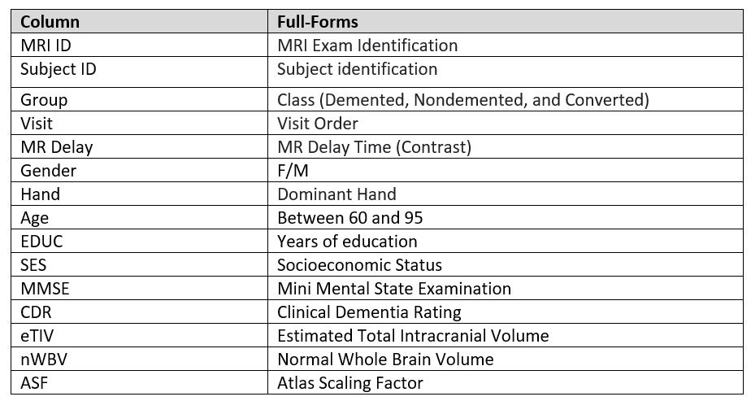
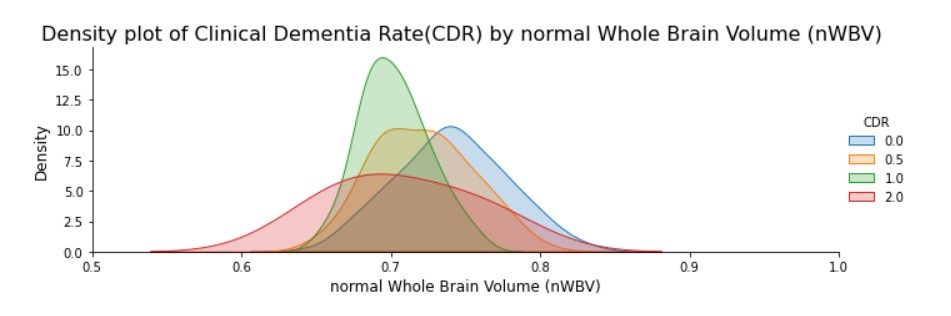
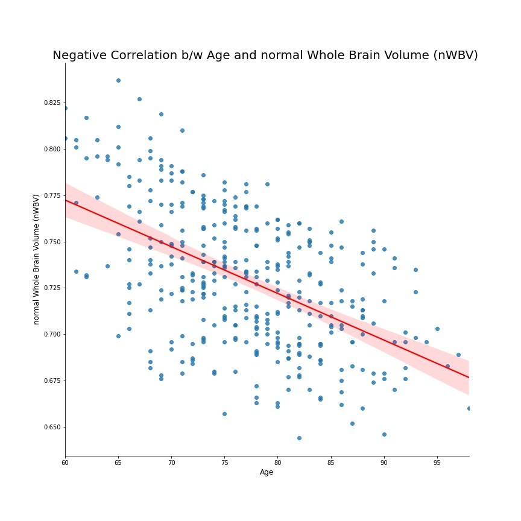
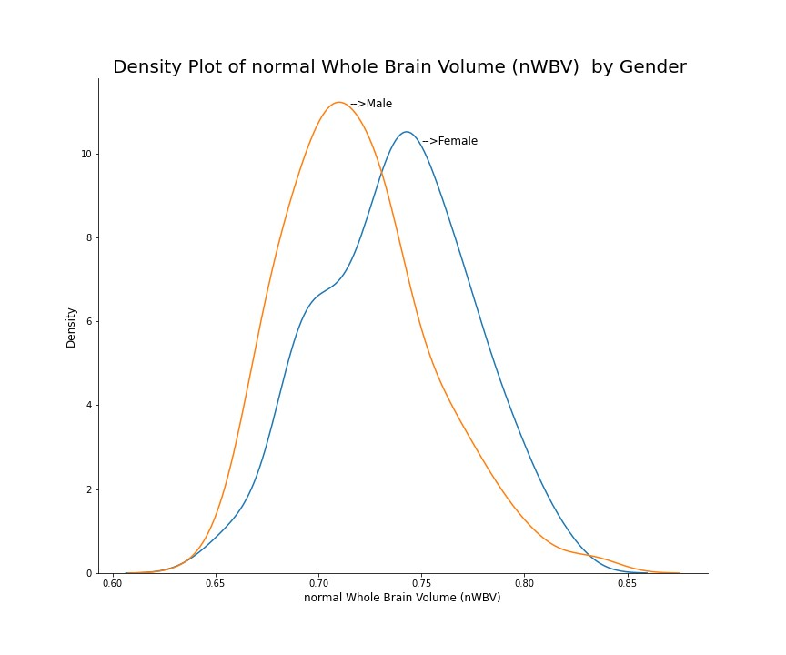

# Cross-sectional MRI Data in Young Middle Aged Nondemented and Demented Older Adults
Alzheimer’s Disease (AD) is the most common form of dementia affecting millions of people worldwide. "We have known for a long time that the brain shrinks in Alzheimer's disease and you can detect this on MRI," says researcher Linda K. McEvoy, PhD, assistant professor of radiology at the University of California, San Diego School of Medicine. In this paper, I am planning to collect data about cross-sectional MRI data among people under different age and visualise it effective manner in order to reveal better clarification bout Alzheimer’s disease.

# I. Data Set

I have downloaded csv file ‘MRI and Alzheimer’s  from ( https://www.kaggle.com/jboysen/mri-and-alzheimers?select=oasis_longitudinal.csv  ).The dataset consists of a longitudinal MRI data of 150 subjects aged 60 to 96 and everyone is right-handed.( This data set includes 373 records and 15 attributes (5 float ,5 integer values, and 5 string values)). Each subject was scanned at least once.72 of the subjects were grouped as 'Nondemented' throughout the study.64 of the subjects were grouped as 'Demented' at the time of their initial visits and remained so throughout the study.14 subjects were grouped as 'Nondemented' at the time of their initial visit and were subsequently characterized as 'Demented' at a later visit. These fall under the 'Converted' category.

# Column Descriptors

<em><b>Table.1 Column Descriptors</b></em>

Among the 3 aspects of big data such as volume, velocity and variety, I tried two consider two factors (volume and velocity) for choosing data set. The selected data set is real time data collected from Open Access Series of Imaging Studies (OASIS). 

# II.	Data Exploration, Processing, Cleaning and/or Integration 

After collecting the data, I did some more filtering to get only the interested data (drop irrelevant data) and also deleted duplicated entries. Here I considered the most important parameter Clinical Dementia Rate (CDR) against normal Whole Brain Volume (nWBV). The CDR Dementia Staging Instrument in one aspect is a 5-point scale used to characterize six domains of cognitive and functional performance applicable to Alzheimer disease and related dementias: Memory, Orientation, Judgment & Problem Solving, Community Affairs, Home & Hobbies, and Personal Care. This score is useful for characterizing and tracking a patient's level of impairment/dementia:

0 = Normal
0.5 = Very Mild Dementia
1 = Mild Dementia
2 = Moderate Dementia
3 = Severe Dementia                

Reference [1] 

Before starting to visualize the data, I classified the data in accordance with NOIR. Here both CDR and nWBV are ratio, also CDR has ordinal data. Because a density plot visualises the distribution of data over a continuous interval or time period.[2], I opted this one for visualising the different orders of CDR v/s nWBV. By analysing the data of CDR vs nWBV, I could find that nWBW decreases as CDR level increases. Then my curiosity tends me to check if any correlation exists between NWBV with years of education, social economy status, gender and age. And so, I start to plot the graph of them.

 
<em><b>Fig.1 CDR vs nWBV </b></em>

First, I plot the graph, that shows the relation between Age and nWBV, because both are ratios, I opted scattered plot graph and also added regression line to illustrates the negative corelation between Age and nWBV. Also, I opted red colour to highlight the regression line.

 
<em><b>Fig.2  Age vs nWBV </b></em>

Then I thought if does gender has any effect on nWBV. Here both data are quantitative and also, I need to see, how probability density of gender related to nWBV. So, I visualised the density plot of nWBV and reached the conclusion that females are healthier than male in given data set because females have higher nWBV values than males but we cannot give strong statement based on this small sample space.

 
<em><b>Fig.3 Density Plot of  nWBV </b></em>

Next, I start to analyse nWBV against the social economy status and nWBV v/s years of Education. But sadly, I couldn't understand much from these plots to certainly say that both SES and EDEC has an influence on nWBV scores. But years of education between 12 and 18 has slightly greater nWBV.

# III. Conclusion 

In conclusion, the data gives some insights how dementia related with age, brain volume, gender, years of education and social economics status. Based on the available data we would say the dementia and the normalise Whole Brain Volume (nWBV) is negatively correlated as well as nWBV is also negatively correlated with age of patient. Interestingly, I found that females have better nWBV than males, thus the females are healthier than male according to this data. In addition to the above-mentioned factors, I could not find any significant relationship between years of study v/s nWBV and social economy status v/s nWBV. I think size of the data and updated data will gives strong evidence for the above my conclusion. Eventhough, I failed to get an idea from SES v/s nWBV graph and EDEC v/s nWBV, this assignment helps me a lot to familiarise about what’s a data visualisation and management subject and I hope I could do better in future by working with more works.

